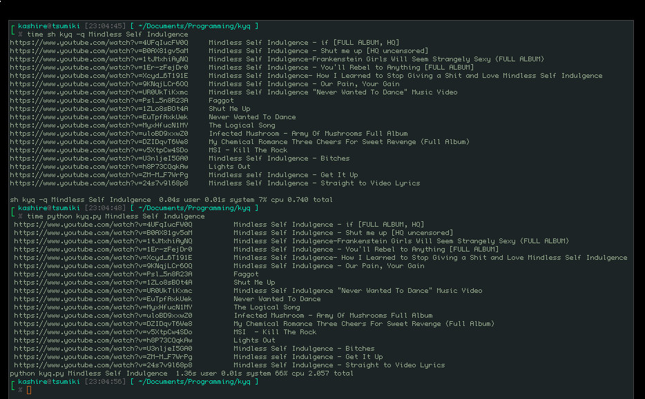

# kashire's youtube query

kyq searches on youtube so you don't have to.
I only made it because I hate opening youtube
to find videos to watch on my desktop.

## how to use
`./kyq -h` for help
`./kyq -q [query]` for searching.
After searching just run it through your favorite video player.
`mpv $url`

You could also use the python script:
`python kyq.py $query` -- No help feature here.

## Speed difference
not the reason I made it but it's interesting to note

## Dependencies
* none for the shell script
* bs4 for the python script.

